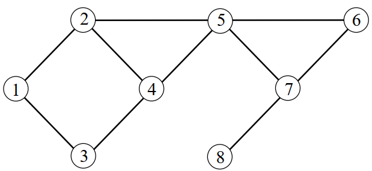

# GRAPH from scratch

## Why we use GRAPHs ?
Well... for various perposes on our life for exemple : 

- **Relations between objects**
- **Detecting short resp(long) distance between two objects**
- **Structure of company or organization**
- **Data transmission between two ends**
- **Routing etc...**
## Exemple of a GRAPH : 

